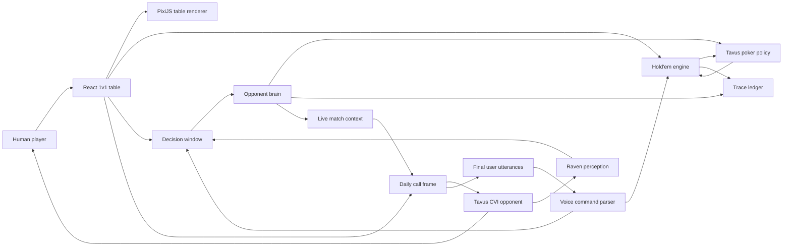

# TavusPoker Architecture

## Thesis

TavusPoker separates objective game truth from embodied human perception.

- The poker engine owns cards, chips, legal actions, and winners.
- The opponent brain owns memory, reads, confidence, and strategy bias.
- Tavus owns embodied presence, conversation, pressure, and live interaction.
- Tavus user utterance events and Raven perception tool calls are the intended live tell sources; local timing and committed actions are baseline engine signals.
- The React UI treats Tavus as the live opponent across a real table; PixiJS renders the felt/cards/chips, Raven/brain state stays private during play, and spoken poker through Tavus/Daily is the primary control path. The action dock mirrors legal actions as backup.

## Runtime Flow

1. `startHoldemHand()` posts blinds, alternates button, deals private cards, and returns legal action.
2. When action is on the user, the app opens a decision window for the exact spot: street, pot, facing bet, stacks, board count, and legal context.
3. Tavus asks for spoken in-world poker actions; it must not tell the user to click buttons or use UI controls.
4. Final Tavus `conversation.utterance` or final `conversation.utterance.streaming` user speech is parsed as a poker command. Browser mic speech uses the same parser. Backup buttons call the same legal-action path.
5. The engine validates the action and sizing. Illegal or incomplete spoken raises ask for clarification instead of being silently clamped.
6. Raven `conversation.perception_tool_call` events, local timing, and committed actions attach to that decision window.
7. `observeHeroAction()` closes the window with the user's legal action, wager, and latency.
8. The opponent brain updates read confidence and builds a `TavusStrategyInput`.
9. `applyHeroAction()` commits the user's chips, advances the engine, and auto-plays Tavus when action reaches Tavus.
10. Tavus policy chooses an action from equity, pot odds, legal state, and the brain's private strategy bias.
11. `recordTavusDecision()` stores the causal chain: poker reason, behavioral reason, confidence, read IDs, evidence IDs.
12. `overwrite_llm_context` syncs the latest match and private brain state into the live Tavus room without accumulating stale hand states.
13. On hand completion, `settleHandReads()` creates a debrief and strengthens or weakens reads.
14. Only post-hand replay/Judge mode reveals the proof chain.
15. The match continues with rising blinds until one stack reaches zero.

## Key Modules

### `src/domain/holdem.ts`

Responsibilities:

- Deck, blinds, button, streets, betting, folds, showdown.
- Legal action generation.
- Chip conservation.
- Rising blind schedule.
- Tavus heuristic action policy.
- Sealed context for Tavus private cards.
- Spoken legal-action context for Tavus, with explicit no-click/no-UI instruction.

### `src/domain/opponentBrain.ts`

Responsibilities:

- Perception signal ledger.
- Raven tool-call ingestion without fake player actions.
- Decision windows that bind behavior to poker context and committed actions.
- Player reads with confidence and evidence.
- Table image: aggression, fold-to-pressure, curiosity, timing volatility.
- Strategy bias generation.
- Tavus decision traces.
- Post-hand debriefs.

### `src/lib/daily.ts`

Responsibilities:

- Mount Tavus rooms with Daily.
- Hide local self-video and participant bar chrome so the Daily frame reads as Tavus's opponent seat.
- Pass returned Tavus `meeting_token` values into Daily when private rooms are enabled.
- Send `conversation.overwrite_llm_context` state snapshots.
- Optionally echo Tavus table talk into the room.

### `src/lib/tavusApiPayloads.ts`

Responsibilities:

- Build Tavus conversation payloads that include both `replica_id` and `persona_id` when a persona is configured.
- Include `require_auth` for authenticated Tavus rooms when configured.
- Build the Raven-enabled table-player persona payload.
- Keep API request shapes testable without starting the Express server or spending Tavus minutes.

### `src/lib/tavusEvents.ts`

Responsibilities:

- Parse Daily app-message payloads from Tavus interaction events.
- Extract final human utterances as speech evidence without trusting partial streaming text.
- Extract Raven poker-tell tool calls as perception evidence.
- Ignore replica speech and non-final streaming utterances for decision binding.

### `src/domain/voice.ts`

Responsibilities:

- Parse spoken actions such as fold, check, call, raise to a number, bet a number, pot, and all-in.
- Support amount-only clarification after Tavus asks for a price.
- Reject non-legal or incomplete commands instead of guessing.
- Convert wording into tell evidence after the engine validates the action.

### `src/App.tsx`

Responsibilities:

- Render the table-first duel room.
- Mount the Tavus Daily frame inside the opponent seat.
- Keep player cards, stack, spoken-action prompt, legal actions, and wager sizing visible while treating controls as backup.
- Route final Tavus room user utterances and browser mic input through the same legal voice-command validator.
- Hide replay/proof while the hand is live.
- Treat `Complete` as a hand-result state with next-hand flow, not as a dead end.
- Show post-hand proof without dumping raw private context.

### `src/components/PokerSceneRenderer.tsx`

Responsibilities:

- Mount a PixiJS canvas into the poker table.
- Render the visible felt, rim, board, pot, chips, hole cards, and shuffle/deal ceremony.
- Keep visual motion in the game layer while React keeps Tavus media, actions, and accessible semantic markup in DOM.
- Suppress the older CSS-only table art so the live hand reads as one game scene.

### `server.ts`

Responsibilities:

- Keep Tavus credentials server-side.
- Create/end Tavus conversations.
- Create a Raven-enabled table-player persona with visual/audio poker-tell tools.
- Support optional private Tavus rooms through `TAVUS_REQUIRE_AUTH=true`.
- Return safe credential readiness flags to the browser.

## Hidden Information Rules

- Tavus private cards are hidden from the player UI until showdown and are sent to Tavus only as its own private hand context.
- The human player's private hole cards are not sent to Tavus before showdown; Tavus must infer from public board, betting, speech, timing, and Raven signals.
- The player UI shows Tavus card backs until showdown.
- Live play never reveals exact reads, confidence, evidence IDs, or strategy bias.
- Tavus can use live reads to pressure the player, but exact tell evidence is sealed until the hand resolves.
- Replay/Judge mode can reveal traces only after the hand is complete.
- Tavus context may include the user's legal spoken options, but not hidden cards, future deck order, or hidden RNG state.

## Prototype Security Boundary

This prototype build keeps the deck and poker engine in the React app so the product can run locally without account infrastructure. The hidden-information guarantees are product/UI/Tavus-context guarantees, not production anti-cheat guarantees against someone inspecting browser memory. A production-money or adversarial version would move deck state, action validation, and hand settlement to a server-authoritative game service and send the browser only the cards it is allowed to render.

## Product Evals

The architecture is only correct if these are true:

- Legal poker state is deterministic and testable.
- The brain can produce evidence-backed reads.
- Same cards plus different observed behavior can change Tavus strategy.
- Perception evidence is attached to the specific poker decision it occurred during.
- Final Tavus user speech is attached to the same concrete decision evidence ledger.
- Raven perception events can enter the same evidence ledger as timing/action tells.
- Every behavioral Tavus decision cites evidence IDs.
- The live Tavus room receives updated match context after decisions.
